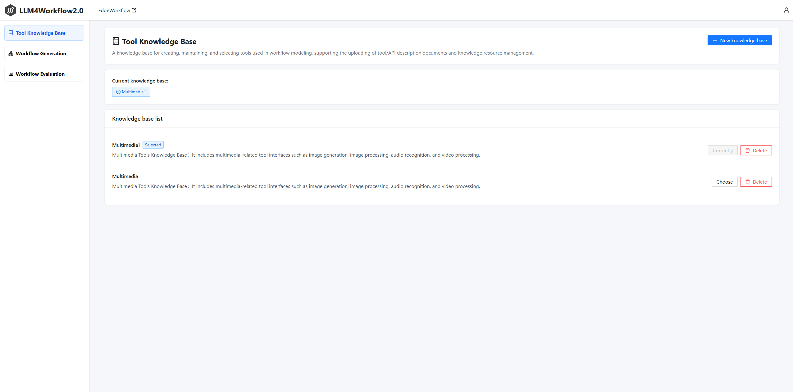
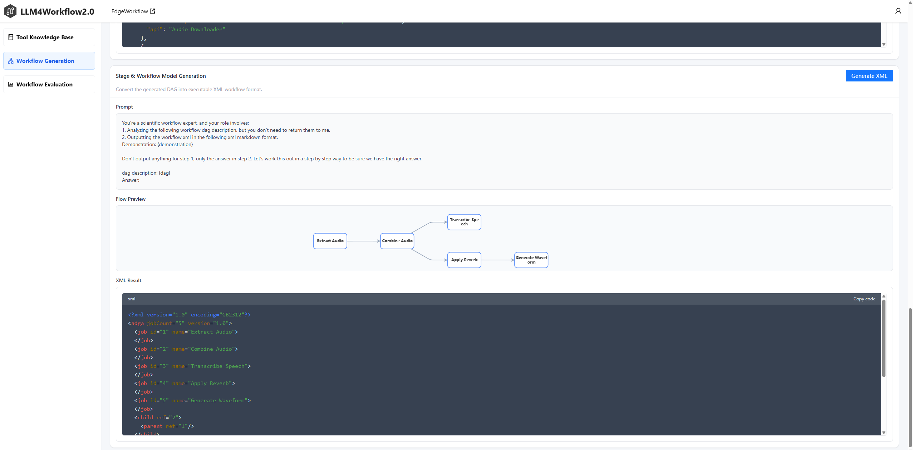
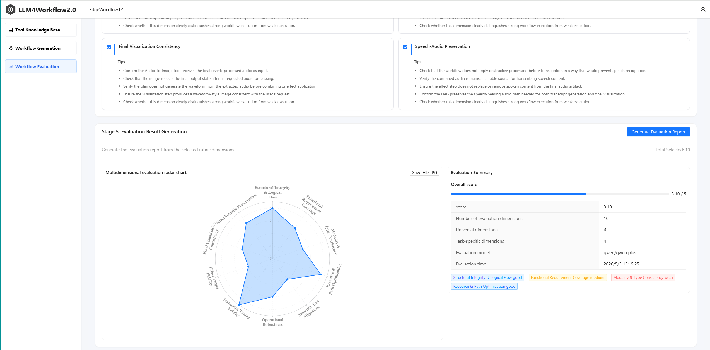
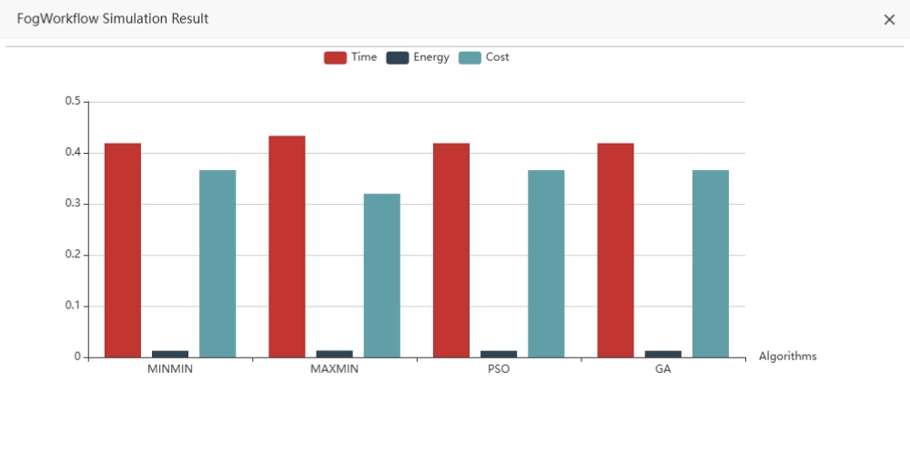
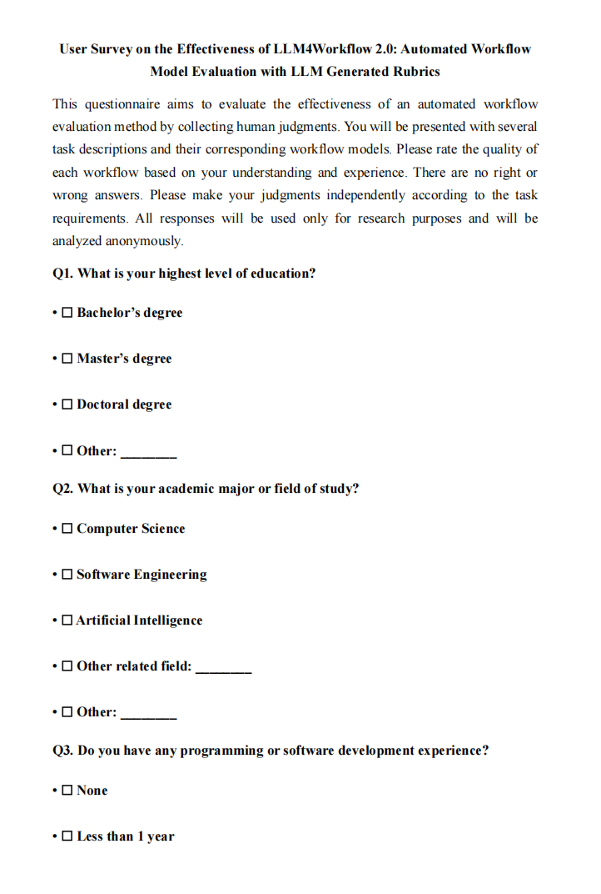
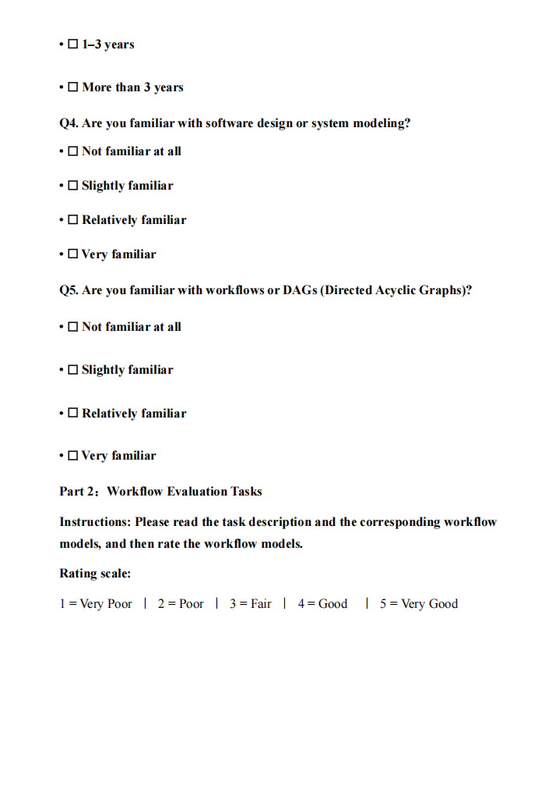
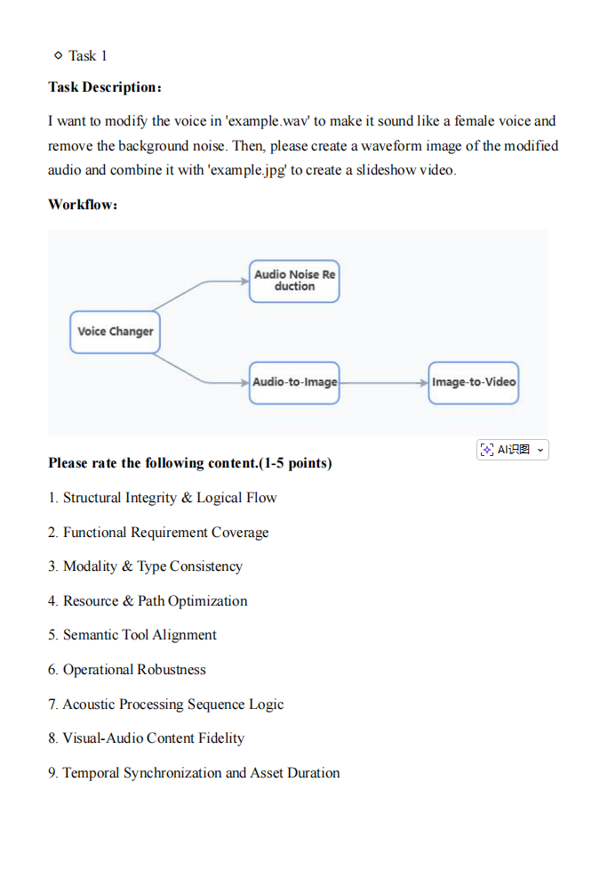
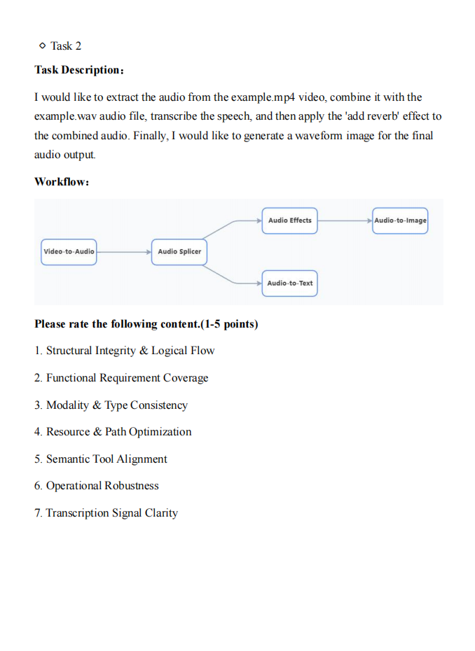

# LLM4Workflow2.0

LLM4Workflow 2.0: Automated Workflow Model Evaluation with LLM Generated Rubrics 





## ✨ Features

🤖  **Automated Model Generation-Evaluation**: automatically generates workflow models from natural language task descriptions
and performs multi-dimensional evaluation.

🔍 **Automated Knowledge Base Construction**: automatically builds a knowledge base for task-relevant APIs to support workflow model generation and evaluation.

🔄  **Automated Process Refinement**: automatically leverages multi-agent discrepancy analysis report to improve the robustness and
discriminability of the rubric.

📊 **Automated Model Verification**: can verify by users that generated high-scoring workflow models achieve better execution performance in real-world workflow systems such as users can deploy workflow models to real-world workflow systems such as [EdgeWorkflow](https://github.com/ISEC-AHU/EdgeWorkflow).

## ✍️ How to use

LLM4Workflow2.0 consists of two main modules: workflow model generation and workflow model evaluation.  


In the workflow model generation module, LLM4Workflow2.0 accepts a workflow description as input and outputs a workflow model in XML format.  The process of workflow model generation comprises four main stages: 

**(1) One-time API Knowledge Base Preparation;**

**(2) Task Extraction and Rewriting;**

**(3) API Retrieval;**

**(4) Workflow Model Generation;**

More details can be found in our previous work [LLM4Workflow](https://github.com/ISEC-AHU/LLM4Workflow).

 In the workflow model evaluation module, the generated workflow model is assessed through a rubric-based multi-dimensional evaluation method. The process of  workflow model  evaluation comprises five main stages:

**(1) Generic Rubric Generation**;

**(2)  Task-Specific Rubric Drafting;**

**(3) Multi-Agent Discrepancy Analysis;**

**(4) Task-Specific Rubric Refinement;**

**(5) Evaluation Result Generation;**

LLM4Workflow2.0 evaluates the generated workflow model by assigning scores across multiple dimensions and determining whether it satisfies developers’ requirements. High-scoring workflow models can be validated on the simulation platform EdgeWorkflow. EdgeWorkflow is a real-world platform for edge computing-based workflow applications. It supports various workflow structures and different evaluation index metrics such as time, energy, and cost.

Here is a comprehensive example demonstrating how to efficiently generate and accurately evaluate workflow models from the workflow description in LLM4Workflow2.0:

We use a multimedia processing workflow task from a public [benchmark](https://github.com/microsoft/JARVIS/tree/main/taskbench/data_multimedia) released by Microsoft. This task requires extracting audio from a video, merging it with an external audio file, transcribing the speech, applying a reverb effect, and generating a waveform image for the final audio output.


For the generated workflow model that has passed the workflow model evaluation, we import it into EdgeWorkflow to execute a workflow instance for simulation testing. The simulation result is shown in the following figure.



## 👮‍♂️ Evaluation

1. Experimental Evaluation

   | Evaluation Method |     Low     |   Medium    |    High     | Average Std. Dev. |
   | :---------------: | :---------: | :---------: | :---------: | :---------------: |
   |  Direct Scoring   | 3.85 ± 1.24 | 4.29 ± 0.97 | 4.02 ± 1.19 |       1.13        |
   |   Gemini 3 Pro    | 3.80 ± 1.02 | 4.12 ± 0.88 | 4.33 ± 0.59 |     **0.63**      |
   |      GPT-4o       | 3.71 ± 1.01 | 4.05 ± 0.83 | 3.80 ± 0.73 |     **0.79**      |
   |      Kimi K2      | 3.46 ± 0.79 | 3.98 ± 0.70 | 3.76 ± 0.70 |     **0.73**      |
   |     Qwen3-Max     | 4.02 ± 0.84 | 4.31 ± 0.70 | 4.25 ± 0.72 |     **0.76**      |

   LLM4Workflow2.0 provides a workflow model evaluation module to assess the generated workflow models. Instead of directly assigning a single overall score, the module evaluates workflows from multiple dimensions, such as structural correctness, task requirement coverage, dependency consistency, and tool/API matching. In our experiments, we use 562 multimedia workflow tasks from a public benchmark released by Microsoft. The tasks are divided into three difficulty levels according to a difficulty score computed from the number of tools, data modalities, workflow nodes, and dependency edges. We compare our evaluation method with a direct LLM-based scoring baseline. The experimental results show that the proposed method produces more stable scores across different task difficulty levels and achieves lower standard deviations across multiple LLM evaluators, including [Gemini 3 Pro](https://gemini.google.com/), [GPT-4o](https://chatgpt.com), [Kimi K2](https://kimi.com), and [Qwen3-Max](https://qwen.ai). This indicates that LLM4Workflow2.0 can reduce the uncertainty of single overall scoring and provide more reliable workflow quality assessment.

2. User Survey

   To further evaluate the practical effectiveness of LLM4Workflow2.0, we conduct a user survey with 15 developers on 30 challenging workflow modeling tasks from a public multimedia processing benchmark. For each task, LLM4Workflow2.0 generates a workflow model and produces multi-dimensional evaluation scores, while developers manually score the generated workflows.

   The following figure shows an example of the user survey interface.

   <p align="center">
     
     
     
     
   </p>
   
   
   
   Among the 15 developers, 5 majored in software engineering and 10 in computer science; 11 held master’s degrees, 2 held bachelor’s degrees, and 2 held doctoral degrees. Overall, they had an average of four years of software development experience and possessed basic knowledge of workflow modeling.
   
   The agreement between LLM4Workflow 2.0 and human-annotated scores is measured using Pearson (r<sub>p</sub>), Spearman (r<sub>s</sub>), and Kendall-Tau (τ) coefficients. The per-developer correlation results are shown below.
   
   | Participant | Pearson (r<sub>p</sub>) | Spearman (r<sub>s</sub>) | Kendall-Tau (τ) |
   | :---------: | :---------------------: | :----------------------: | :-------------: |
   |     P1      |          0.924          |          0.911           |      0.852      |
   |     P2      |          0.905          |          0.895           |      0.830      |
   |     P3      |          0.917          |          0.897           |      0.840      |
   |     P4      |          0.893          |          0.874           |      0.813      |
   |     P5      |          0.928          |          0.916           |      0.849      |
   |     P6      |          0.912          |          0.911           |      0.838      |
   |     P7      |          0.923          |          0.893           |      0.848      |
   |     P8      |          0.914          |          0.890           |      0.837      |
   |     P9      |          0.899          |          0.901           |      0.838      |
   |     P10     |          0.918          |          0.907           |      0.835      |
   |     P11     |          0.883          |          0.947           |      0.836      |
   |     P12     |          0.913          |          0.911           |      0.842      |
   |     P13     |          0.891          |          0.870           |      0.808      |
   |     P14     |          0.924          |          0.915           |      0.839      |
   |     P15     |          0.917          |          0.905           |      0.830      |
   | **Average** |        **0.911**        |        **0.903**         |    **0.836**    |
   
   Across the 15 developers, LLM4Workflow 2.0 achieves average scores of 0.91, 0.90, and 0.84 on r<sub>p</sub>, r<sub>s</sub>, and τ, respectively, showing that LLM4Workflow 2.0 provides evaluation results that are consistent with human evaluation.

## 🎥 Demonstration

For more details, you can watch the [demo video](https://www.youtube.com/watch?v=dmSU7cz_hC4).

## 🛠️ Getting Started

To run LLM4Workflow 2.0, follow these steps:

1. Clone this repository:`git clone https://github.com/FJL1314/LLM4Workflow2.0.git LLM4Workflow2.0`

2. Navigate to the backend directory: `cd LLM4Workflow2.0/backend`

3. Set up the Python  environment: `virtualenv venv && source venv/bin/activate && poetry install`

4. Start the Postgres server: `docker-compose up`

5. Configure environment variables:

   ```sh
   # Obtain OpenAI API access from https://openai.com/blog/openai-api
   OPENAI_API_KEY=<your-api-key>
   ```

6. Start the backend server: `server`

7. Set up the frontend environment: `cd frontend && npm install`

8. Start the frontend (dev) server: `npm run start`

9. Your application should now be up and running in your browser! If you need to change the startup port, you can configure it in the `vite.config.ts` file.
